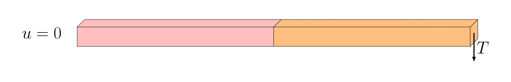

# Hyper-elastic and Elastic Multi-material/law Beam

## Description of the problem

This example aims in providing an example of a 3D beam of dimensions $`40\times1\times1`$ composed of two materials.

The beam is subdivided into two subdomains of dimensions $`20\times1\times1`$ with different material constitutive laws and material properties. The left side of the beam is stiff and elastic whereas its right side is soft and hyper-elastic.



The beam is clamped on its left face (Dirichlet boundary condition) and a vertical traction force is applied on its right face (Neumann Boundary condition).

The objective is to find the resulting displacement. 

## Implementation

### Geometry creation using GMSH

Given the strong compatibility between GMSH and FEniCSx it is recommended to use GMSH. GMSH also has a python API. The mesh, refinement and marking operations can be proceeded in GMSH and imported in the FEniCSx environment.

#### Libraries
Being a python API, the gmsh environment needs to be first loaded:
```python
import gmsh
import numpy
import sys
``` 

### Mesh initializing
The model can be initialized:
```python
gmsh.initialize()
gmsh.clear()
gmsh.model.add("3D_Elastic")
```
The dimension of the problem as well as the mesher options can be defined:
```python
gdim = 3
# 
#Characteristic length
lc = 40/20
gmsh.model.occ.synchronize()
gmsh.option.setNumber("General.Terminal",1)
gmsh.option.setNumber("Mesh.Optimize", True)
gmsh.option.setNumber("Mesh.OptimizeNetgen", True)
gmsh.option.setNumber("Mesh.MeshSizeMin", 0.1*lc)
gmsh.option.setNumber("Mesh.MeshSizeMax", lc)
gmsh.model.occ.synchronize()
# gmsh.option.setNumber("Mesh.MshFileVersion", 2.0)
# gmsh.option.setNumber("Mesh.MeshSizeExtendFromBoundary", 0.002)
# gmsh.option.setNumber("Mesh.MeshSizeFromPoints", 0)
# gmsh.option.setNumber("Mesh.MeshSizeFromCurvature", 5)
```

#### Geometry
Using the OpenCascade kernel, reference geometries can directly be created:
```python3
s1 = gmsh.model.occ.addBox(0, 0, 0, 20, 1, 1, tag=-1)
s2 = gmsh.model.occ.addBox(20, 0, 0, 20, 1, 1, tag=-1)
# 
# Remove duplicate entities and synchronize
gmsh.model.occ.removeAllDuplicates()
gmsh.model.occ.synchronize()
```
It is recommended to export the geometry to visualize and validate:
```python3
gmsh.model.occ.synchronize()
gmsh.write('3D_beam.geo_unrolled')
```

#### Marking
GMSH creates the mesh for physical groups. Each of these groups are marked. All lines, surfaces and volumes of the model can be listed with:
```python3
lines, surfaces, volumes = [gmsh.model.getEntities(d) for d in [1, 2, 3]]
```
It is then required to create empty lists and tag values:
```python3
left, top, right, bottom = [], [], [], []
tag_left, tag_top, tag_right, tag_bottom = 1, 2, 3, 4
left_surf, right_surf = [], []
tag_left_surf, tag_right_surf = 10, 20
```

The lists can be automatically filled by identification of the faces and volumes based on their center of mass position:
```python3
for border in surfaces:
    center_of_mass = gmsh.model.occ.getCenterOfMass(border[0], border[1])
    if numpy.isclose(center_of_mass[0],0):
        left.append(border[1])
    elif numpy.isclose(center_of_mass[2],1):
        top.append(border[1])
    elif numpy.isclose(center_of_mass[0],40):
        right.append(border[1])
    elif numpy.isclose(center_of_mass[2],0):
        bottom.append(border[1])
```
Alternatively they can be hand filled using the geo_unrolled filed and visualizing in the GMSH GUI.

To assign the surface tags, we run the following:
```python3
gmsh.model.addPhysicalGroup(gdim-1, left, tag_left)
gmsh.model.setPhysicalName(gdim-1, tag_left, 'Left')
# 
gmsh.model.addPhysicalGroup(gdim-1, top, tag_top)
gmsh.model.setPhysicalName(gdim-1, tag_top, 'Top')
# 
gmsh.model.addPhysicalGroup(gdim-1, right, tag_right)
gmsh.model.setPhysicalName(gdim-1, tag_right, 'Right')
# 
gmsh.model.addPhysicalGroup(gdim-1, bottom, tag_bottom)
gmsh.model.setPhysicalName(gdim-1, tag_bottom, 'Bottom')
```
Similarly for the volumes:
```python3
for volume in volumes:
    center_of_mass = gmsh.model.occ.getCenterOfMass(volume[0], volume[1])
    if center_of_mass[0]<20:
        left_surf.append(volume[1])
    else:
        right_surf.append(volume[1])
# 
gmsh.model.addPhysicalGroup(gdim, left_vol, tag_left_vol)
gmsh.model.setPhysicalName(gdim, tag_left_vol, 'left')
# 
gmsh.model.addPhysicalGroup(gdim, right_vol, tag_right_vol)
gmsh.model.setPhysicalName(gdim, tag_right_vol, 'right')
```

Once again it is recommended to check the geometry identification:
```python
gmsh.model.occ.synchronize()
gmsh.write('3D_elastic.geo_unrolled')
```

The mesh is generated and exported:
```python
gmsh.model.mesh.generate(gdim)
gmsh.write("3D_elastic_mesh.msh")
```

Executing the following command at the end run the GMSH Gui for visualization before finalizing the model:
```python
if 'close' not in sys.argv:
    gmsh.fltk.run()
# 
gmsh.finalize()
```

### Finite Element Computation

#### Libraries
Computing the Finite element problem within FEniCSx in python requires to load the libraries:

```python
import dolfinx
from dolfinx.fem.petsc import NonlinearProblem
from dolfinx.nls.petsc import NewtonSolver
import ufl
import basix
import petsc4py
import mpi4py
import numpy
import pyvista
``` 
One can assess the version of FEniCSx with the following:
```python
print("Dolfinx version is:",dolfinx.__version__)
```
#### Mesh Loading

We load the mesh, facet and cell tags from the msh file created:

```python
filename    = "./3D_elastic_mesh.msh"
# 
domain, cell_tag, facet_tag = dolfinx.io.gmshio.read_from_msh(filename, mpi4py.MPI.COMM_WORLD, 0, gdim=3)
```

It is recommended to regularly implement tests to ensure that the domain is well tagged. For instance, for cell tags, we can check that the marked cells have the same length than the mesh cells:

```python
# Ensure all cells have been properly tagged
cells_left  = [x for x in cell_tag.indices if (cell_tag.values[x] == 10)]
cells_right = [x for x in cell_tag.indices if (cell_tag.values[x] == 20)]
# 
try :
    assert(len(cell_tag.indices)   == len(cells_left)+len(cells_right))
    if mpi4py.MPI.COMM_WORLD.rank  == 0:
        print("All cell tags have been attributed")
except:
    if mpi4py.MPI.COMM_WORLD.rank  == 0:
        print("*************") 
        print("Forgotten tags => material badly defined")
        print("*************") 
        exit()
```

To verify if the domain is well tagged, an XDMF file can be created as follows:

```python
with dolfinx.io.XDMFFile(mpi4py.MPI.COMM_WORLD, "verif.xdmf", "w") as xdmf:
    xdmf.write_mesh(domain)
    xdmf.write_meshtags(facet_tag,domain.geometry)
```

#### Material parameters
The Lamé coefficients are defined for both sides of the beam, with a Poisson ratio which has been kept constant for all subdomains.

```python3
# Young's Moduli
E_left  = dolfinx.fem.Constant(domain, dolfinx.default_scalar_type(1e8))
E_right = dolfinx.fem.Constant(domain, dolfinx.default_scalar_type(2.5e4))
# 
# Poisson ratio
nu = dolfinx.fem.Constant(domain, dolfinx.default_scalar_type(0.3))
# 
# Lamé Coefficients
lmbda_m_left   = dolfinx.fem.Constant(domain, dolfinx.default_scalar_type(E_left.value*nu.value/((1+nu.value)*(1-2*nu.value))))   
mu_m_left      = dolfinx.fem.Constant(domain, dolfinx.default_scalar_type(E_left.value/(2*(1+nu.value)))) 
lmbda_m_right  = dolfinx.fem.Constant(domain, dolfinx.default_scalar_type(E_right.value*nu.value/((1+nu.value)*(1-2*nu.value))))   
mu_m_right     = dolfinx.fem.Constant(domain, dolfinx.default_scalar_type(E_right.value/(2*(1+nu.value)))) 
```

The left subdomain is assumed to follow the Hookean constitutive law such that $` \mathbf{\sigma}(\mathbf{u}) = 2 \mu \mathbf{\varepsilon}(\mathbf{u}) + \lambda \mathrm{tr}(\mathbf{\varepsilon}(\mathbf{u}))\mathbf{I_d}:`$
```python
# Constitutive Law
def Hookean(mu,lmbda):
    return 2.0 * mu * ufl.sym(ufl.grad(u)) + lmbda * ufl.tr(ufl.sym(ufl.grad(u))) * ufl.variable(ufl.Identity(len(u)))
```

The right subdomain is assumed to follow the Hookean constitutive law such that $` \mathbf{\sigma}(\mathbf{u}) = \frac{\mathrm{d}\psi}{\mathrm{d}F}, \text{ with } \psi = \frac{\mu}{2} (\mathrm{tr}(F^T F)-3)-\mu\ln(\mathrm{det}F)+\frac{\lambda}{2} (\ln(\mathrm{det}F))^2:`$
```python
def Neo_Hoolean(mu,lmbda):
    # Spatial dimension
    d   = len(u)
    # Identity tensor
    I   = ufl.variable(ufl.Identity(d))
    # Deformation gradient
    F   = ufl.variable(I + ufl.grad(u))
    # Right Cauchy-Green tensor
    C   = ufl.variable(F.T * F)
    # Invariants of deformation tensors
    Ic  = ufl.variable(ufl.tr(C))
    J   = ufl.variable(ufl.det(F))
    # Stored strain energy density (compressible neo-Hookean model)
    psi = (mu / 2) * (Ic - 3) - mu * ufl.ln(J) + (lmbda / 2) * (ufl.ln(J))**2
    return ufl.diff(psi, F)
```
**Remark:** Note that the hereabove functions must be introduced after the definition of u.

The body forces and traction forces are defined using:
```python
# Body forces vector
B = dolfinx.fem.Constant(domain, dolfinx.default_scalar_type((0, 0, 0)))
# Traction force vector
T = dolfinx.fem.Constant(domain, dolfinx.default_scalar_type((0, 0, 0)))
```
The choice of a constant allows to dynamically update the value with time. It is of interest for boundary conditions and loading.

#### Function spaces, Functions and operators

To identify the displacement, we chose a vectorial 2nd order Lagrange representation (P2). The XDMF does not support high order functions so we also create a first order space in which we will interpolate the solution:
```python3
# Vector Element
P1_v = basix.ufl.element("P", domain.topology.cell_name(), degree=1, shape=(domain.topology.dim,))
P2_v = basix.ufl.element("P", domain.topology.cell_name(), degree=2, shape=(domain.topology.dim,))
# Function_spaces
P1v_space = dolfinx.fem.functionspace(domain, P1_v)
V         = dolfinx.fem.functionspace(domain, P2_v)
```

The mathematical spaces being defined, one can introduce the functions, expressions for interpolation, test functions and trial functions. It is recommended to place them all at a same position for debugging.

```python3
v  = ufl.TestFunction(V)
u  = dolfinx.fem.Function(V)
du = ufl.TrialFunction(V)
u_export      = dolfinx.fem.Function(P1v_space)
u_export.name = "u"
u_expr        = dolfinx.fem.Expression(u,P1v_space.element.interpolation_points())
u_export.interpolate(u_expr)
u_export.x.scatter_forward()
```

The following operators are also defined:
```python
metadata = {"quadrature_degree": 4}
ds       = ufl.Measure('ds', domain=domain, subdomain_data=facet_tag, metadata=metadata)
dx       = ufl.Measure("dx", domain=domain, metadata=metadata, subdomain_data=cell_tag)
```


To evaluate a reaction force or a displacement over a surface, a form can be used such that:
```python3
# Evaluation of the displacement on the edge
Nz                = dolfinx.fem.Constant(domain, numpy.asarray((0.0,0.0,1.0)))
Displacement_expr = dolfinx.fem.form((ufl.dot(u,Nz))*ds(3))
```
is equivalent to:
```math
\frac{1}{{\partial\Omega_t}}\int_{\partial\Omega_t} u\cdot N_t \mathrm{d}S,~\text{with } \overrightarrow{T}=T~N_t
```

For a volume, we would have had $`\frac{1}{V}\int f \mathrm{d}\Omega`$ computed with:
```python3
volume_eval = dolfinx.fem.form(f*dx)
```

The form is computed later after the solver application. 

#### Dirichlet boundary conditions
The boundary condition being fixed (no dynamically imposed displacement), the clamp is defined as follows:

```python
u_bc = numpy.array((0,) * domain.geometry.dim, dtype=dolfinx.default_scalar_type)
# 
left_dofs = dolfinx.fem.locate_dofs_topological(V, facet_tag.dim, facet_tag.find(1))
bcs       = [dolfinx.fem.dirichletbc(u_bc, left_dofs, V)]
```

#### Variationnal form

For an elastic problem, the variationnal form to be solved is:

```math
\int_{\Omega_{left}} Hookean(u):\varepsilon(v)\mathrm{d}\Omega + \int_{\Omega_{right}} NeoHookean(u):\varepsilon(v)\mathrm{d}\Omega - \int_\Omega B\cdot v \mathrm{d}\Omega -  \int_{\partial\Omega_t}T\cdot v \mathrm{d}S = 0
```
where B stands for the body forces, T the traction forces, u is the unknown and v the test function. 

This is traduced in FEniCSx with:

```python
F   = ufl.inner(ufl.grad(v), Hookean(mu_m_left,lmbda_m_left)) * dx(10) + ufl.inner(ufl.grad(v), Neo_Hoolean(mu_m_right,lmbda_m_right)) * dx(20) - ufl.inner(v, B) * dx - ufl.inner(v, T) * ds(3)
```
The Jacobian of the problem can further be defined with:

```python
J__ = ufl.derivative(F, u, du)
```

Finally the problem is introduced as:
```python
problem = NonlinearProblem(F, u, bcs, J=J__)
solver = NewtonSolver(domain.comm, problem)
```

#### Solver settings:
The solver settings are defined as follows:
```python
# Absolute tolerance
solver.atol                  = 1e-8
# relative tolerance
solver.rtol                  = 1e-8
# Convergence criterion
solver.convergence_criterion = "incremental"
# Maximum iterations
solver.max_it                = 15
# Solver Pre-requisites
ksp                                               = solver.krylov_solver
opts                                              = petsc4py.PETSc.Options()
option_prefix                                     = ksp.getOptionsPrefix()
opts[f"{option_prefix}ksp_type"]                  = "preonly"
opts[f"{option_prefix}pc_type"]                   = "lu"
opts[f"{option_prefix}pc_factor_mat_solver_type"] = "mumps"
ksp.setFromOptions()
```

#### Solving and post-processing

This example provide a gif with the displacement magnitude as well as a xdmf file. Please refer to the python file. A minimal resolution code is hereafter presented.

To have the full computation log, the following is required. These information are crucial when debugging.

```python
#----------------------------------------------------------------------
# Debug instance
log_solve=True
if log_solve:
    from dolfinx import log
    log.set_log_level(log.LogLevel.INFO)
#----------------------------------------------------------------------
```

For stability concerns, we increment the load to reach the solution:

```python
# Load increment
tval0 = -0.75
# Loop to get to the total load
for n in range(1, 10):
    T.value[2]         = n * tval0
    num_its, converged = solver.solve(u)
    u.x.scatter_forward()
    try:
        assert (converged)
    except:
        if MPI.COMM_WORLD.rank == 0:
            print("*************") 
            print("Solver failed")
            print("*************") 
        break
    # 
    u_export.interpolate(u_expr)
    u_export.x.scatter_forward()
    # Evaluate the displacement
    displacement_      = dolfinx.fem.assemble_scalar(Displacement_expr)
    Surface            = 1*1
    displacement_right = 1/Surface*domain.comm.allreduce(displacement_, op=mpi4py.MPI.SUM)
    print("Edge displacement:", displacement_right)
    # 
    print(f"Time step {n}, Number of iterations {num_its}, Load {T.value}")
    xdmf.write_function(u_export,n*tval0)
xdmf.close()
```