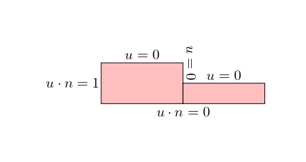
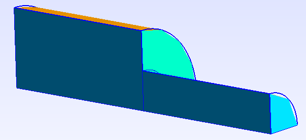

# Stokes Problem (3D)

The following directory contains the application of a 3D Stokes Problem. 

The geometry is created using GMSH. Two different pipelines are proposed. It consists in two quarter of cylinders of different heights with an inflow imposed on the left side and a no slip condition for the upper sides.

<p align="center">
  
</p>

The objective is to find the resulting velocity and pressure.

# Implementation

Given the strong compatibility between GMSH and FEniCSx it is recommended to use GMSH. GMSH also has a python API. The mesh, refinement and marking operations can be proceeded in GMSH and imported in the FEniCSx environment. 

## Geomerty creation using GMSH
### From a 2D Geometry

For this example we start from the 2D geometry generated for the 2D Stoke example and we apply a revolution operation. Similarly, an extrusion operation can be operated within GMSH.

#### Libraries and settings

As for any GMSH API code, one must first import the libraries

```python
import gmsh
import numpy
import sys
```

The geometrical and dimension of the problem can then be specified:
```python
L1 = 2.
H1 = 1.
L2 = 2.
H2 = 0.5
# Dimension of the problem,
gdim = 3
```

The gmsh model is initialised with its internal settings specified:
```python
gmsh.initialize()
gmsh.clear()
gmsh.model.add("3D_Stokes")
#Characteristic length
lc = (L1+L2)/50
gmsh.model.occ.synchronize()
gmsh.option.setNumber("General.Terminal",1)
gmsh.option.setNumber("Mesh.Optimize", True)
gmsh.option.setNumber("Mesh.OptimizeNetgen", True)
gmsh.option.setNumber("Mesh.MeshSizeMin", 0.1*lc)
gmsh.option.setNumber("Mesh.MeshSizeMax", lc)
gmsh.model.occ.synchronize()
# gmsh.option.setNumber("Mesh.MshFileVersion", 2.0)
# gmsh.option.setNumber("Mesh.MeshSizeExtendFromBoundary", 0.002)
# gmsh.option.setNumber("Mesh.MeshSizeFromPoints", 0)
# gmsh.option.setNumber("Mesh.MeshSizeFromCurvature", 5)
```

#### Geometry

To compute the geometry, we first generate the rectangles:
```python
# Left square
A = [0, 0]
C = [L1, H1]
D = [L1, 0]
# Right square
E = [(L1+L2), H2]
# 
# gmsh.model.occ.addRectangle(x, y, z, dx, dy, tag=-1, roundedRadius=0.)
s1 = gmsh.model.occ.addRectangle(A[0], A[1], 0, L1, H1, tag=-1)
s2 = gmsh.model.occ.addRectangle(D[0], D[1], 0, L2, H2, tag=-1)
# 
gmsh.model.occ.synchronize()
```

Then, we operate a revolution operation:
```python
# gmsh.model.occ.revolve(dimTags, x, y, z, ax, ay, az, angle, numElements=[], heights=[], recombine=False)
gmsh.model.occ.revolve([(2,s1),(2,s2)], 0,0,0, 1, 0, 0, -numpy.pi/2)
gmsh.model.occ.synchronize()
```
As a safeguard, we ensure removing all duplicates and export the geometry fot control:
```python
gmsh.model.occ.removeAllDuplicates()
# 
gmsh.model.occ.synchronize()
gmsh.write('3D_Stokes.geo_unrolled')
```

#### Marking

GMSH creates the mesh for physical groups. Each of these groups are marked. All lines, surfaces and volumes of the model can be listed with:

```python
lines, surfaces, volumes = [gmsh.model.getEntities(d) for d in [1, 2, 3]]
boundaries = gmsh.model.getBoundary(volumes, oriented=False)
```

It is then required to create empty lists and tag values:

```python
left, top_left, middle_up, top_right, right, bottom, front = [], [], [], [], [], [], []
tag_left, tag_top_left, tag_middle_up, tag_top_right, tag_right, tag_bottom, tag_front = 1, 2, 3, 4, 5, 6,7
left_vol, right_vol = [], []
tag_left_vol, tag_right_vol = 10, 20
```

The lists can be automatically filled by identification of the faces and volumes based on their center of mass position:
```python
for boundary in boundaries:
  center_of_mass = gmsh.model.occ.getCenterOfMass(boundary[0], boundary[1])
  if numpy.isclose(center_of_mass[0],0):
    left.append(boundary[1])
  elif (center_of_mass[0]>H2) and (center_of_mass[1]>H2):
    top_left.append(boundary[1])
  elif numpy.isclose(center_of_mass[0],L1):
    middle_up.append(boundary[1])
  elif numpy.isclose(center_of_mass[0],L1+L2):
    right.append(boundary[1])
  elif numpy.isclose(center_of_mass[1],0):
    bottom.append(boundary[1])
  elif numpy.isclose(center_of_mass[2],0):
    front.append(boundary[1])
  else:
    top_right.append(boundary[1])
```

Alternatively they can be hand filled using the geo_unrolled filed and visualizing in the GMSH GUI.

To assign the surface tags, we run the following:
```python
gmsh.model.addPhysicalGroup(gdim-1, left, tag_left)
gmsh.model.setPhysicalName(gdim-1, tag_left, 'Left')
# 
gmsh.model.addPhysicalGroup(gdim-1, top_left, tag_top_left)
gmsh.model.setPhysicalName(gdim-1, tag_top_left, 'Top_left')
# 
gmsh.model.addPhysicalGroup(gdim-1, middle_up, tag_middle_up)
gmsh.model.setPhysicalName(gdim-1, tag_middle_up, 'Middle_up')
# 
gmsh.model.addPhysicalGroup(gdim-1, top_right, tag_top_right)
gmsh.model.setPhysicalName(gdim-1, tag_top_right, 'Top_right')
# 
gmsh.model.addPhysicalGroup(gdim-1, right, tag_right)
gmsh.model.setPhysicalName(gdim-1, tag_right, 'Right')
# 
gmsh.model.addPhysicalGroup(gdim-1, bottom, tag_bottom)
gmsh.model.setPhysicalName(gdim-1, tag_bottom, 'Bottom')
# 
gmsh.model.addPhysicalGroup(gdim-1, front, tag_front)
gmsh.model.setPhysicalName(gdim-1, tag_front, 'Front')
```

Similarly for the volumes:
```python
for volume in volumes:
  center_of_mass = gmsh.model.occ.getCenterOfMass(volume[0], volume[1])
  if center_of_mass[0]<L1:
    left_vol.append(volume[1])
  else:
    right_vol.append(volume[1])
# 
gmsh.model.addPhysicalGroup(gdim, left_vol, tag_left_vol)
gmsh.model.setPhysicalName(gdim, tag_left_vol, 'left')
# 
gmsh.model.addPhysicalGroup(gdim, right_vol, tag_right_vol)
gmsh.model.setPhysicalName(gdim, tag_right_vol, 'right')
```

Once again it is recommended to check the geometry identification:
```python
gmsh.model.occ.synchronize()
gmsh.write('3D_Stokes_marked.geo_unrolled')
```

The mesh is generated and exported:
```python
gmsh.model.mesh.generate(gdim)
gmsh.write("3D_Stokes_mesh.msh")
```

Executing the following command at the end run the GMSH Gui for visualization before finalizing the model:
```python
if 'close' not in sys.argv:
    gmsh.fltk.run()
```
```python
gmsh.finalize()
```

### From elementary geometries
When you have elementary entities defining your domain, it is often easier to use them and use boolean operations (cut,fragment,fuse,*etc.*). In the present case the Geometry could be created simply with two cylinders. 

The beginning is the same:

```python
#----------------------------------------------------------------------
# Libraries
#----------------------------------------------------------------------
# 
import gmsh
import numpy
import sys
# 
#----------------------------------------------------------------------
# Geometrical parameters
#----------------------------------------------------------------------
L1 = 2.
H1 = 1.
L2 = 2.
H2 = 0.5
# Dimension of the problem,
gdim = 3
#----------------------------------------------------------------------
# 
#----------------------------------------------------------------------
# Set options
#----------------------------------------------------------------------
# 
gmsh.initialize()
gmsh.clear()
gmsh.model.add("3D_Stokes")
#Characteristic length
lc = (L1+L2)/60
gmsh.model.occ.synchronize()
gmsh.option.setNumber("General.Terminal",1)
gmsh.option.setNumber("Mesh.Optimize", True)
gmsh.option.setNumber("Mesh.OptimizeNetgen", True)
gmsh.option.setNumber("Mesh.MeshSizeMin", 0.1*lc)
gmsh.option.setNumber("Mesh.MeshSizeMax", lc)
gmsh.model.occ.synchronize()
# gmsh.option.setNumber("Mesh.MshFileVersion", 2.0)
# gmsh.option.setNumber("Mesh.MeshSizeExtendFromBoundary", 0.002)
# gmsh.option.setNumber("Mesh.MeshSizeFromPoints", 0)
# gmsh.option.setNumber("Mesh.MeshSizeFromCurvature", 5)
```

Then, two cylinders are added and our geometry is finished:
```python
# gmsh.model.occ.addCylinder(x, y, z, dx, dy, dz, r, tag=-1, angle=2*pi)
cylinder = gmsh.model.occ. addCylinder(0 ,0 ,0 ,L1 ,0 ,0 ,H1,tag =10 , angle=numpy.pi/2)
gmsh.model.occ. synchronize ()
cylinder2 = gmsh.model.occ. addCylinder(L1 ,0 ,0 ,L2 ,0 ,0 ,H2,tag =20 , angle=numpy.pi/2)
gmsh.model.occ. synchronize ()
```
The duplicates are removed and a check file is generated.
```python
# Remove duplicate entities and synchronize
gmsh.model.occ.removeAllDuplicates()
# 
gmsh.model.occ.synchronize()
gmsh.write('3D_Stokes.geo_unrolled')
```

All the following steps (marking, meshing) are the same as previously:

```python
#----------------------------------------------------------------------
# Create physical group for mesh generation and tagging
#----------------------------------------------------------------------
# 
lines, surfaces, volumes = [gmsh.model.getEntities(d) for d in [1, 2, 3]]
boundaries = gmsh.model.getBoundary(volumes, oriented=False)
# 
left, top_left, middle_up, top_right, right, bottom, front = [], [], [], [], [], [], []
tag_left, tag_top_left, tag_middle_up, tag_top_right, tag_right, tag_bottom, tag_front = 1, 2, 3, 4, 5, 6,7
left_vol, right_vol = [], []
tag_left_vol, tag_right_vol = 10, 20
# 
for boundary in boundaries:
  center_of_mass = gmsh.model.occ.getCenterOfMass(boundary[0], boundary[1])
  if numpy.isclose(center_of_mass[0],0):
    left.append(boundary[1])
  elif (center_of_mass[0]>H2) and (center_of_mass[1]<-H2):
    top_left.append(boundary[1])
  elif numpy.isclose(center_of_mass[0],L1):
    middle_up.append(boundary[1])
  elif numpy.isclose(center_of_mass[0],L1+L2):
    right.append(boundary[1])
  elif numpy.isclose(center_of_mass[1],0):
    bottom.append(boundary[1])
  elif numpy.isclose(center_of_mass[2],0):
    front.append(boundary[1])
  else:
    top_right.append(boundary[1])
# 
gmsh.model.addPhysicalGroup(gdim-1, left, tag_left)
gmsh.model.setPhysicalName(gdim-1, tag_left, 'Left')
# 
gmsh.model.addPhysicalGroup(gdim-1, top_left, tag_top_left)
gmsh.model.setPhysicalName(gdim-1, tag_top_left, 'Top_left')
# 
gmsh.model.addPhysicalGroup(gdim-1, middle_up, tag_middle_up)
gmsh.model.setPhysicalName(gdim-1, tag_middle_up, 'Middle_up')
# 
gmsh.model.addPhysicalGroup(gdim-1, top_right, tag_top_right)
gmsh.model.setPhysicalName(gdim-1, tag_top_right, 'Top_right')
# 
gmsh.model.addPhysicalGroup(gdim-1, right, tag_right)
gmsh.model.setPhysicalName(gdim-1, tag_right, 'Right')
# 
gmsh.model.addPhysicalGroup(gdim-1, bottom, tag_bottom)
gmsh.model.setPhysicalName(gdim-1, tag_bottom, 'Bottom')
# 
gmsh.model.addPhysicalGroup(gdim-1, front, tag_front)
gmsh.model.setPhysicalName(gdim-1, tag_front, 'Front')
# 
for volume in volumes:
  center_of_mass = gmsh.model.occ.getCenterOfMass(volume[0], volume[1])
  if center_of_mass[0]<L1:
    left_vol.append(volume[1])
  else:
    right_vol.append(volume[1])
# 
print(surfaces)
gmsh.model.addPhysicalGroup(gdim, left_vol, tag_left_vol)
gmsh.model.setPhysicalName(gdim, tag_left_vol, 'left')
# 
gmsh.model.addPhysicalGroup(gdim, right_vol, tag_right_vol)
gmsh.model.setPhysicalName(gdim, tag_right_vol, 'right')
# 
gmsh.model.occ.synchronize()
gmsh.write('3D_Stokes_marked.geo_unrolled')
# 
gmsh.model.mesh.generate(gdim)
gmsh.write("3D_Stokes_mesh.msh")
```
```python
if 'close' not in sys.argv:
    gmsh.fltk.run()
```
```python
gmsh.finalize()
```

## Finite Element Computation

### Libraries
Computing the Finite element problem within FEniCSx in python requires to load the libraries:

```python
import dolfinx
import ufl
import basix
import mpi4py
import petsc4py
from dolfinx.fem.petsc import NonlinearProblem
from dolfinx.nls.petsc import NewtonSolver
```

One can assess the version of FEniCSx with the following:
```python
print("Dolfinx version is:",dolfinx.__version__)
```

### Mesh Loading
We load the mesh, facet and cell tags from the msh file created:

```python
mesh, cell_tag, facet_tag = dolfinx.io.gmshio.read_from_msh('./3D_Stokes_mesh.msh', mpi4py.MPI.COMM_WORLD, 0, gdim=3)
```

### Function spaces, Functions and expressions

For stability reasons, we create a mixed element P2vxP1 for (u,p) to solve the Stokes problem:
```python
# Finite Element 
P1       = basix.ufl.element("P", mesh.topology.cell_name(), degree=1)
# Vector Element
P1_v     = basix.ufl.element("P", mesh.topology.cell_name(), degree=1, shape=(mesh.topology.dim,))
P2_v     = basix.ufl.element("P", mesh.topology.cell_name(), degree=2, shape=(mesh.topology.dim,))
# Mixed element
MxE      = basix.ufl.mixed_element([P1,P2_v])
# Tensor Element to compute the stress
tensor_elem  = basix.ufl.element("P", mesh.topology.cell_name(), degree=1, shape=(3,3))
```

The associated function spaces with the element types are:
```python
P1v_space = dolfinx.fem.functionspace(mesh, P1_v)
CHS       = dolfinx.fem.functionspace(mesh, MxE)
tensor_space = dolfinx.fem.functionspace(mesh, tensor_elem)
```

One can then specify the functions and if needed their expression for interpolation:
```python
u_export      = dolfinx.fem.Function(P1v_space)
u_export.name = "u"
# 
sol    = dolfinx.fem.Function(CHS)
q, w   = ufl.TestFunctions(CHS)
# Solution vector
p, u   = ufl.split(sol)
# 
# Definition of the normal vector
n      = ufl.FacetNormal(mesh)
```

The operators are also defined at this point:
```python
# Specify the desired quadrature degree
q_deg = 4
# Redefinition dx and ds
dx    = ufl.Measure('dx', metadata={"quadrature_degree":q_deg}, subdomain_data=cell_tag, domain=mesh)
ds    = ufl.Measure("ds", domain=mesh, subdomain_data=facet_tag)
```

### Boundary conditions

Three different type of dirichlet boundary conditions are introduced:
- no-slip conditions for the velocity on the top left / top right and top middle boundaries,
- inflow of $`v_x=1`$ on the left boundary,
- Symmetry condition $`v_y=0`$ on the bottom boundary,
- Symmetry condition $`v_z=0`$ on the front boundary.

```python
bcs = []
fdim = mesh.topology.dim - 1
# 
def add_dirichlet_BC(functionspace,dimension,facet,value):
  dofs   = dolfinx.fem.locate_dofs_topological(functionspace, dimension, facet)
  bcs.append(dolfinx.fem.dirichletbc(value, dofs, functionspace))
# 
# No-slip boundary condition for velocity
# top left
add_dirichlet_BC(CHS.sub(1).sub(0),fdim,facet_tag.find(2), petsc4py.PETSc.ScalarType(0.))
add_dirichlet_BC(CHS.sub(1).sub(1),fdim,facet_tag.find(2), petsc4py.PETSc.ScalarType(0.))
add_dirichlet_BC(CHS.sub(1).sub(2),fdim,facet_tag.find(2), petsc4py.PETSc.ScalarType(0.))
# top right
add_dirichlet_BC(CHS.sub(1).sub(0),fdim,facet_tag.find(4), petsc4py.PETSc.ScalarType(0.))
add_dirichlet_BC(CHS.sub(1).sub(1),fdim,facet_tag.find(4), petsc4py.PETSc.ScalarType(0.))
add_dirichlet_BC(CHS.sub(1).sub(2),fdim,facet_tag.find(4), petsc4py.PETSc.ScalarType(0.))
# middle up
add_dirichlet_BC(CHS.sub(1).sub(0),fdim,facet_tag.find(3), petsc4py.PETSc.ScalarType(0.))
add_dirichlet_BC(CHS.sub(1).sub(1),fdim,facet_tag.find(3), petsc4py.PETSc.ScalarType(0.))
add_dirichlet_BC(CHS.sub(1).sub(2),fdim,facet_tag.find(3), petsc4py.PETSc.ScalarType(0.))
# 
# inflow vx = 1 left side
add_dirichlet_BC(CHS.sub(1).sub(0),fdim,facet_tag.find(1), petsc4py.PETSc.ScalarType(1.))
add_dirichlet_BC(CHS.sub(1).sub(1),fdim,facet_tag.find(1), petsc4py.PETSc.ScalarType(0.))
add_dirichlet_BC(CHS.sub(1).sub(2),fdim,facet_tag.find(1), petsc4py.PETSc.ScalarType(0.))
# 
# Symmetry plan vy = 0 bottom
add_dirichlet_BC(CHS.sub(1).sub(1),fdim,facet_tag.find(6), petsc4py.PETSc.ScalarType(0.))
# 
# Symmetry plan vz = 0 front
add_dirichlet_BC(CHS.sub(1).sub(2),fdim,facet_tag.find(7), petsc4py.PETSc.ScalarType(0.))
```

### Variational form

The objective is to find (u,p), such that we have the following variationnal form:
```math
\int_\Omega \nabla(u):\nabla(w) r\mathrm{d}\Omega + \int_\Omega \nabla\cdot(w)\,p\,r\mathrm{d}\Omega + \int_\Omega q\,\nabla\cdot(u)\,r\mathrm{d}\Omega-\int_\Omega f\cdot w r \mathrm{d}\Omega = 0
```
This can be introduced as:

```python
b = dolfinx.fem.Constant(mesh,(0.0, 0.0, 0.0))
F = ufl.inner(ufl.grad(u), ufl.grad(w))*dx + ufl.div(w)*p*dx + q*ufl.div(u)*dx - ufl.inner(b, w)*dx
```

### Solving and Post-Processing
To have the full computation log, the following is required. These information are crucial when debugging.

```python
#----------------------------------------------------------------------
# Debug instance
log_solve=True
if log_solve:
    from dolfinx import log
    log.set_log_level(log.LogLevel.INFO)
#----------------------------------------------------------------------
```

We solve the problem using the nonlinear approach:
```python
problem = NonlinearProblem(F, sol, bcs)
solver = NewtonSolver(mesh.comm, problem)
#  
# Absolute tolerance
solver.atol                  = 1e-8
# relative tolerance
solver.rtol                  = 1e-8
# Convergence criterion
solver.convergence_criterion = "incremental"
# Maximum iterations
solver.max_it                = 15
# Solver Pre-requisites
ksp                                               = solver.krylov_solver
opts                                              = petsc4py.PETSc.Options()
option_prefix                                     = ksp.getOptionsPrefix()
opts[f"{option_prefix}ksp_type"]                  = "preonly"
opts[f"{option_prefix}pc_type"]                   = "lu"
opts[f"{option_prefix}pc_factor_mat_solver_type"] = "mumps"
ksp.setFromOptions()
num_its, converged = solver.solve(sol)
sol.x.scatter_forward()
```

Once the problem is solved, we can apply the post processing:
```python
# Get sub-functions
p_, u_ = sol.split()
p_.name = "p"
# 
u_expr = dolfinx.fem.Expression(sol.sub(1),P1v_space.element.interpolation_points())
u_export.interpolate(u_expr)
u_export.x.scatter_forward()
```

At this point other quantities such as the strain rate and the stress can further be computed and saved in an xdmf file:
```python
strainrate=dolfinx.fem.Function(tensor_space)
strainrate.name = "strainrate"
# 0.5*(grad_cyl(u_export) + grad_cyl(u_export).T)
strainrate_expr = dolfinx.fem.Expression(ufl.sym(ufl.grad(u_)),tensor_space.element.interpolation_points())
strainrate.interpolate(strainrate_expr)
strainrate.x.scatter_forward()
# # 
eta=1
Id = ufl.Identity(3)
stress=dolfinx.fem.Function(tensor_space)
stress.name = "stress"
stress_expr = dolfinx.fem.Expression(-1.*p_*Id + eta*2*ufl.sym(ufl.grad(u_)),tensor_space.element.interpolation_points())
stress.interpolate(stress_expr)
stress.x.scatter_forward()
# 
xdmf = dolfinx.io.XDMFFile(mesh.comm, "3D_Stokes.xdmf", "w")
xdmf.write_mesh(mesh)
t=0
xdmf.write_function(u_export,t)
xdmf.write_function(p_,t)
xdmf.write_function(strainrate,t)
xdmf.write_function(stress,t)
```

One can further represent the velocity field with glyphs using pyvista:
```python
import pyvista
import numpy
pyvista.start_xvfb()
topology, cell_types, geometry = dolfinx.plot.vtk_mesh(P1v_space)
values = numpy.zeros((geometry.shape[0], 3), dtype=numpy.float64)
values[:, :len(u_export)] = u_export.x.array.real.reshape((geometry.shape[0], len(u_export)))

# Create a point cloud of glyphs
function_grid = pyvista.UnstructuredGrid(topology, cell_types, geometry)
function_grid["u"] = values
glyphs = function_grid.glyph(orient="u", factor=0.1)

# Create a pyvista-grid for the mesh
grid = pyvista.UnstructuredGrid(*dolfinx.plot.vtk_mesh(mesh, mesh.topology.dim))

# Create plotter
plotter = pyvista.Plotter()
# plotter.add_mesh(grid, style="wireframe", color="k")
plotter.add_mesh(grid, color="grey", ambient=0.02, opacity=0.05 , show_edges=False)
plotter.add_mesh(glyphs, cmap='coolwarm')
plotter.update_scalar_bar_range([1, 8])
plotter.view_vector((0, 3, -20))
plotter.show_axes()
# plotter.view_xy()
plotter.save_graphic('Result.pdf')
plotter.close()
```